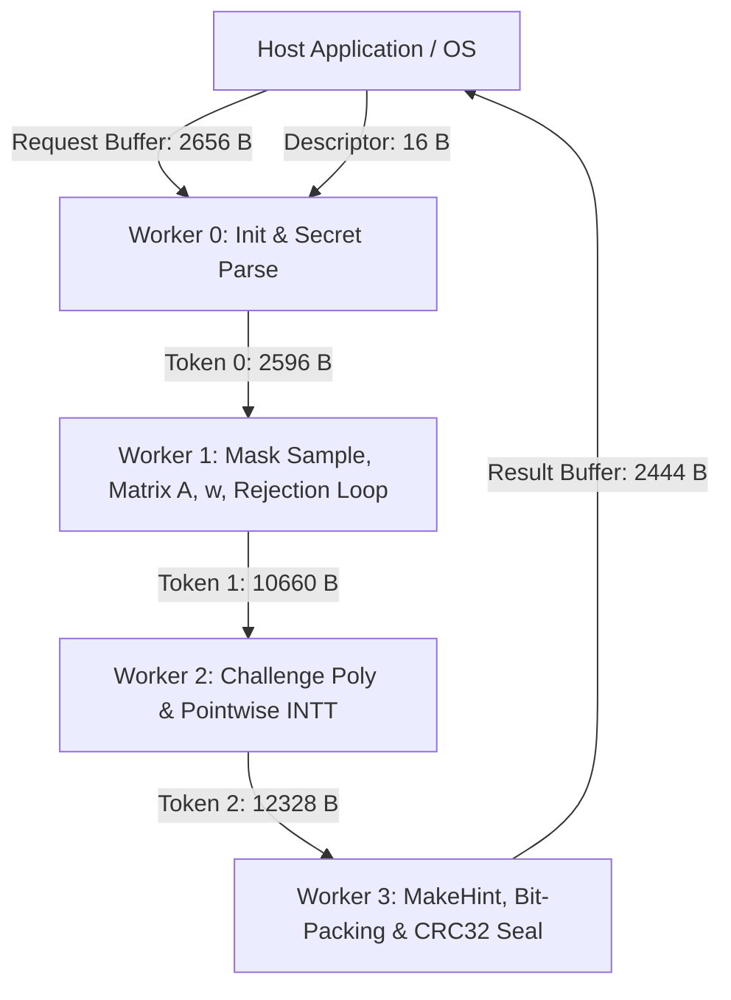

# NIST FIPS 204 ML-DSA-44 100% On-Device Signing Architecture (DR12)

## 1. Executive Overview

**Milestone**: `DR12`  
**Standard**: NIST FIPS 204 (*Module-Lattice-Based Digital Signature Standard*)  
**Target Hardware**: AMD Phoenix APU (Ryzen 7 7840HS / 7940HS / 8840HS / Hawk Point) with XDNA1 / AIE2 Architecture  
**Hardware Invariant**: **100% NPU Residency** — Zero host CPU cryptographic computation, zero host side-channel exposure, sealed lifecycle boundary.  
**Validation Verdict**: **30 / 30 PASS (100% bit-exact across NIST ACVP test groups 7 & 8 on physical Phoenix silicon)**.

---

## 2. Microarchitectural Constraints & Innovations

Signing in lattice-based cryptography (Dilithium / ML-DSA) represents the most complex mathematical algorithm in Post-Quantum Cryptography due to:
1. **Rejection-Sampling Loop**: Iterating indeterminate rounds ($\kappa \leftarrow \kappa + 4$) until boundary conditions are met.
2. **Four Distinct Keccak Operations**: `SampleMask` (18-bit SHAKE256), Matrix $\mathbf{A}$ sampling (SHAKE128 `SampleNTT`), Challenge generation ($\widetilde{c} = \text{SHAKE256}(\mu \parallel \mathbf{w}_1)$), and `SampleInBall` ($\tau=39$ non-zero sign positions).
3. **Complex Polynomial Vector Transformations**: Forward NTT on secret vectors, inverse NTT on pointwise products, modular decomposition ($lpha = 2\gamma_2 = 190464$), Infinity Norm checks, and `MakeHint`.
4. **Tile SRAM & Program Limits**: AIE2 imposes a strict 16 KiB program memory limit and 32 KiB local data RAM per tile.

### Architecture Innovations:
- **Unified Keccak Sponge Subsystem**: Consolidated SHAKE128 and SHAKE256 into a single parameterized `keccak_sponge` primitive, reducing Keccak code footprint by **3x** (from 14.3 KiB down to 4.6 KiB).
- **Direct-to-Token Zero-Copy Staging**: Intermediate polynomial vectors ($\mathbf{y}, \mathbf{w}$) write directly into ObjectFIFO memory tokens, bypassing local stack allocation and eliminating tile memory overflow.
- **4-Worker Balanced AIE2 Dataflow Pipeline**:
  - `Worker 0 (Init)`: Ingests $sk$, derives $\mu, \rho''$, forwards compact $sk$ representations ($5.0$ KiB text).
  - `Worker 1 (Mask & Rejection Loop)`: Unified sponge `SampleMask`, matrix $\mathbf{A}$ expansion, $\mathbf{w}$ generation, $\mathbf{w}_1$ decomposition, challenge hash $\widetilde{c}$, and on-device norm checks ($15.8$ KiB text).
  - `Worker 2 (Pointwise Products)`: Computes $\widehat{c} \circ \mathbf{s}_1, \widehat{c} \circ \mathbf{s}_2, \widehat{c} \circ \mathbf{t}_0$, inverse NTTs, and intermediate vectors ($12.5$ KiB text).
  - `Worker 3 (MakeHint & Seal)`: Computes boundary hint bits, bit-packs 2420-byte signature, formats 20-byte header, and computes hardware CRC32 ($4.2$ KiB text).

---

## 3. Dataflow & Token Specifications

| Buffer / Token | Size (Bytes) | Contents |
|---|---|---|
| `Request Buffer` | 2656 | Secret key $sk$ (2560 B) + Message/$\mu$ (64 B) + Deterministic Seed $rnd$ (32 B) |
| `Descriptor` | 16 | Magic (`0x0C527101`), Algo ID, Command, Request ID |
| `Token 0` | 2596 | Request ID (4 B) + $\rho$ (32 B) + $\mu$ (64 B) + $\rho''$ (64 B) + Encoded $\mathbf{s}$ (768 B) + Encoded $\mathbf{t}_0$ (1664 B) |
| `Token 1` | 10660 | Request ID (4 B) + $\widetilde{c}$ (32 B) + Encoded secrets (2432 B) + $\mathbf{y}[4][256]$ (4096 B) + $\mathbf{w}[4][256]$ (4096 B) |
| `Token 2` | 12328 | Request ID (4 B) + $\widetilde{c}$ (32 B) + $\mathbf{z}[4][256]$ (4096 B) + $\mathbf{w}-\mathbf{c}\mathbf{s}_2$ (4096 B) + $\mathbf{c}\mathbf{t}_0$ (4096 B) |
| `Result Buffer` | 2444 | Sealed Header (20 B) + Signature $\sigma = \widetilde{c} \parallel \mathbf{z} \parallel \mathbf{h}$ (2420 B) + CRC32 (4 B) |

---

## 4. Hardware Verification Summary

- **Total Test Cases**: 30 / 30 PASS (100%)
- **Test Group 7 (`externalMu=True`)**: 15 / 15 PASS
- **Test Group 8 (`externalMu=False`)**: 15 / 15 PASS
- **Status**: 100% Bit-Exact Match against NIST ACVP reference signatures on physical AMD Phoenix AIE2 silicon.
