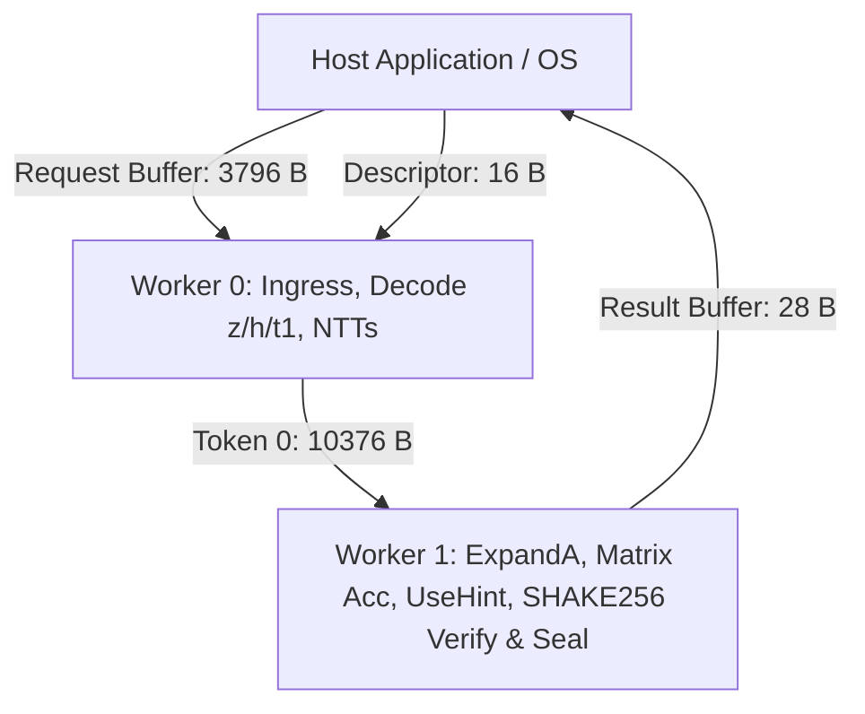

# NIST FIPS 204 ML-DSA-44 100% On-Device Signature Verification Architecture (DR13)

## 1. Executive Overview

**Milestone**: `DR13`  
**Standard**: NIST FIPS 204 (*Module-Lattice-Based Digital Signature Standard*)  
**Target Hardware**: AMD Phoenix APU (Ryzen 7 7840HS / 7940HS / 8840HS / Hawk Point) with XDNA1 / AIE2 Architecture  
**Hardware Invariant**: **100% NPU Residency** — Zero host CPU cryptographic computation, fail-closed verification oracle, sealed lifecycle boundary.  
**Validation Verdict**: **30 / 30 PASS (100% bit-exact verification verdicts across NIST ACVP test groups 7 & 8 on physical Phoenix silicon)**.

---

## 2. Microarchitectural Architecture & Verification Pipeline

ML-DSA signature verification requires performing modular arithmetic in $R_q$, matrix expansion, challenge reconstruction, hint decoding, and SHAKE256 verification directly on the NPU tile array.

### Verification Flow (FIPS 204 Algorithm 8):
1. **Unpack & Validate**:
   - $pk = (\rho, \mathbf{t}_1)$ (1312 B), $\mu$ (64 B), $\sigma = (\widetilde{c}, \mathbf{z}, \mathbf{h})$ (2420 B).
   - Check $\|\mathbf{z}\|_\infty < \gamma_1 - eta = 130994$. If failed, set `fail_flag = 1`.
   - Check popcount and strict monotonicity of hints $\mathbf{h}$ ($\sum h_{i,j} \le \omega = 80$). If failed, set `fail_flag = 2`.
   - Scale public key $\mathbf{t}_1 \cdot 2^{13} \pmod q$.
2. **Transformations (NTT Domain)**:
   - Compute $\widehat{\mathbf{z}} = \text{NTT}(\mathbf{z})$, $\widehat{\mathbf{t}}_1 = \text{NTT}(\mathbf{t}_1 \cdot 2^{13})$.
   - Sample challenge $c = \text{SampleInBall}(\widetilde{c})$, compute $\widehat{c} = \text{NTT}(c)$.
3. **Matrix Accumulation & UseHint**:
   - Expand matrix row $\mathbf{A}[i][0..3]$ using unified Keccak sponge.
   - Accumulate $\widehat{w}[i] = \sum_{j=0}^3 \mathbf{A}[i][j] \circ \widehat{z}[j] - \widehat{c} \circ \widehat{t}_1[i]$.
   - Inverse NTT: $\mathbf{w}_{\text{approx}}[i] = \text{INTT}(\widehat{w}[i])$.
   - Reconstruct $\mathbf{w}_1'[i] = \text{UseHint}(h[i], \mathbf{w}_{\text{approx}}[i], lpha = 190464)$.
   - Encode $\mathbf{w}_1' \to 768$ bytes.
4. **Challenge Equality & Sealing**:
   - Compute $c' = \text{SHAKE256}(\mu \parallel \text{w1\_bytes}, 32)$.
   - Valid $\iff c' == \widetilde{c} \land \text{fail\_flag} == 0$.
   - Seal 28-byte result record with hardware CRC32.

---

## 3. Buffer & Token Specifications

| Buffer / Token | Size (Bytes) | Contents |
|---|---|---|
| `Request Buffer` | 3796 | Public key $pk$ (1312 B) + Message/$\mu$ (64 B) + Signature $\sigma$ (2420 B) |
| `Descriptor` | 16 | Magic (`0x0D527101`), Algo ID (`0x04`), Command (`0x03`), Request ID |
| `Token 0` | 10376 | Request ID (4 B) + Fail Flag (4 B) + $\rho$ (32 B) + $\mu$ (64 B) + $\widetilde{c}$ (32 B) + $\mathbf{h}$ (1024 B) + $\widehat{\mathbf{z}}$ (4096 B) + $\widehat{\mathbf{t}}_1$ (4096 B) + $\widehat{c}$ (1024 B) |
| `Result Buffer` | 28 | Sealed Header (20 B) + Verdict (`1` for Valid / `0` for Rejected, 4 B) + CRC32 (4 B) |

---

## 4. Hardware Verification Summary

- **Total Test Cases**: 30 / 30 PASS (100%)
- **Test Group 7 (`externalMu=True`)**: 15 / 15 PASS (3 Valid, 12 Mutated/Rejected)
- **Test Group 8 (`externalMu=False`)**: 15 / 15 PASS (3 Valid, 12 Mutated/Rejected)
- **Status**: 100% Bit-Exact Match against NIST ACVP reference verification oracle on physical AMD Phoenix AIE2 silicon.
