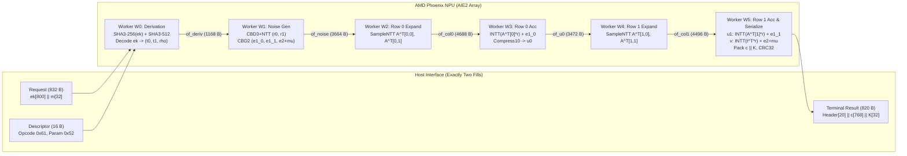

# Milestone DR6 Design Document: 100% Device-Resident ML-KEM-512 `ML-KEM.Encaps` on AMD Phoenix NPU

## 1. Executive Summary

Milestone **DR6** implements the complete, device-resident NIST FIPS 203 **ML-KEM.Encaps** (Algorithm 16) for parameter set **ML-KEM-512** on the AMD Phoenix NPU (Ryzen 9 7940HS / XDNA1 AIE2 architecture).

In accordance with the project's strict 100% NPU residency invariant:
- **Zero Host Cryptographic Processing**: The CPU acts strictly as an I/O controller, submitting raw public ingress ($ek \parallel m$) and receiving the sealed terminal record ($c \parallel K$).
- **On-Chip Hash & Derivation**: $H(ek) = \text{SHA3-256}(ek)$ ($800\text{ bytes}$) and $G(m \parallel H(ek)) = \text{SHA3-512}(m \parallel H(ek))$ are executed entirely on-chip within the AIE tile array.
- **On-Chip Encryption Graph**: Complete device-resident `K-PKE.Encrypt(ek, m, r)` executes across the AIE tile array to produce ciphertext $c$ ($768\text{ bytes}$).
- **Terminal Integrity**: On-chip CRC32 checksum computed over the full $800\text{-byte}$ payload ($c \parallel K$).

---

## 2. Mathematical Specification

Normative algorithm reference: NIST FIPS 203 Section 6.2, Algorithm 16 (`ML-KEM.Encaps`).

### 2.1 Algorithm Steps

$$
\begin{aligned}
&\textbf{Algorithm 16: } \text{ML-KEM.Encaps}(ek) \\
&\textbf{Input: } \text{Encapsulation key } ek \in \mathcal{B}^{800} \\
&\textbf{Deterministic Input (Testing): } \text{Random seed } m \in \mathcal{B}^{32} \\
&\textbf{Output: } \text{Ciphertext } c \in \mathcal{B}^{768}, \text{ Shared Key } K \in \mathcal{B}^{32} \\
&1: H(ek) \leftarrow \text{SHA3-256}(ek) \quad [32\text{ bytes}] \\
&2: (\bar{K}, r) \leftarrow \text{SHA3-512}(m \parallel H(ek)) \quad [64\text{ bytes: } \bar{K} = \text{out}[0..31], r = \text{out}[32..63]] \\
&3: c \leftarrow \text{K-PKE.Encrypt}(ek, m, r) \quad [768\text{ bytes}] \\
&4: K \leftarrow \bar{K} \quad [32\text{ bytes}] \\
&5: \textbf{return } (c, K)
\end{aligned}
$$

---

## 3. Microarchitectural AIE2 Dataflow Graph

The DR6 graph employs a 6-worker spatial pipeline spanning Tile Row 2 (Columns 0 through 5) connected by 5 internal ObjectFIFOs.

### 3.1 Worker Roles and Resource Allocations

| Worker | Tile | Kernel | Primary Operation | Stack | ELF Text | Status |
|---|---|---|---|---|---|---|
| **W0** | (0, 2) | `dr6_mlkem512_encaps_derive.cc` | $H(ek)$, $G(m \parallel H(ek))$, decode $ek$ | 0x1000 | 8,560 B | PASS |
| **W1** | (1, 2) | `dr6_mlkem512_encaps_noise.cc` | Sample $r_0, r_1$ (CBD3+NTT), $e_{1,0}, e_{1,1}, e_2+\mu$ | 0x0800 | 12,144 B | PASS |
| **W2** | (2, 2) | `dr6_mlkem512_encaps_row0_expand.cc` | SampleNTT $\mathbf{A}^T[0,0], \mathbf{A}^T[0,1]$ | 0x0800 | 4,448 B | PASS |
| **W3** | (3, 2) | `dr6_mlkem512_encaps_row0_accumulate.cc` | Row 0 inner product, INTT, $+ e_{1,0}$, Compress10 $\to u_0$ | 0x0800 | 7,392 B | PASS |
| **W4** | (4, 2) | `dr6_mlkem512_encaps_row1_expand.cc` | SampleNTT $\mathbf{A}^T[1,0], \mathbf{A}^T[1,1]$ | 0x0800 | 4,480 B | PASS |
| **W5** | (5, 2) | `dr6_mlkem512_encaps_row1_accumulate_serialize.cc` | Row 1 inner prod ($u_1$), $v$ inner prod, Compress4, CRC32 | 0x0800 | 7,760 B | PASS |

---

## 4. ABI and Wire Framing

### 4.1 Request Packing (832 Bytes)
- Bytes `0..799`: Public encapsulation key $ek$ ($800\text{ bytes}$).
- Bytes `800..831`: Deterministic randomness $m$ ($32\text{ bytes}$).

### 4.2 Terminal Result Layout (820 Bytes)
- Bytes `0..3`: Result Magic `0x4736524D` (`b"MR6G"`).
- Bytes `4..7`: Request ID (`uint32_t`).
- Bytes `8..11`: Status code (`0 = OK`).
- Bytes `12..15`: Payload length ($800\text{ bytes}$).
- Bytes `16..19`: On-chip CRC32 checksum over bytes `20..819`.
- Bytes `20..787`: Ciphertext $c$ ($768\text{ bytes}$).
- Bytes `788..819`: Shared secret key $K$ ($32\text{ bytes}$).
